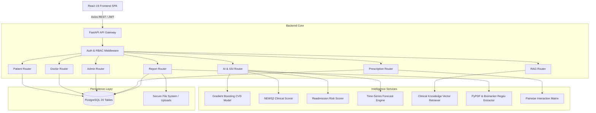

# System Architecture & Technical Specifications

## MEDiTWIN-AI Platform Architecture

### 1. High-Level Architectural Pattern
MediTwin-AI is designed using a **Modular Layered Architecture** separating the Presentation Layer (React 19 SPA), the Application/Service Layer (FastAPI RESTful micro-services), the Clinical Intelligence Engines (ML, XAI, RAG, Document Extraction), and the Persistence Layer (PostgreSQL Relational Storage).

---

### 2. Database Schema Design (20 Entities)

1. **`users`**: System identities with encrypted passwords (`bcrypt`), role enumeration (`DOCTOR`, `PATIENT`, `ADMIN`), and active status.
2. **`doctors`**: Physician profiles with medical licenses, specializations, departments, consultation fees, and hospital affiliations.
3. **`patients`**: Digital health twin records with emergency contacts, blood type, height/weight, and lifestyle factors (smoking, alcohol, exercise).
4. **`medical_records`**: Longitudinal vital sign history (BP, HR, SpO2, Temp, RR, Glucose) with timestamped clinical observations.
5. **`clinical_notes`**: Physician consultation notes, SOAP assessments, and differential diagnoses.
6. **`patient_allergies`**: Specific drug and environmental allergens with clinical reaction severity.
7. **`patient_conditions`**: Active chronic disease registry with diagnosis dates and management status.
8. **`medical_reports`**: Uploaded diagnostic PDFs, extracted raw OCR text, structured JSON biomarker mappings, and dual-mode AI summaries.
9. **`prescriptions`**: Header records for doctor orders, diagnostic indications, and special usage instructions.
10. **`prescription_items`**: Individual pharmaceutical items with dosage, route, frequency, and duration.
11. **`medications`**: Master drug formulary database with generic names, therapeutic classes, and standard doses.
12. **`drug_interactions`**: Pre-computed clinical interaction pairs with severity levels and pharmacokinetic mechanisms.
13. **`appointments`**: Scheduled consultation slots, specialist assignments, status trackers, and patient symptoms.
14. **`departments`**: Clinical specialty wings and divisions.
15. **`hospital_beds`**: Inpatient ward and bed allocations with occupancy status.
16. **`icu_units`**: Critical care telemetry units and mechanical ventilator allocations.
17. **`inventory_items`**: Pharmacy stock items with quantities, reorder thresholds, batch numbers, and expirations.
18. **`ai_predictions`**: Historical records of AI risk assessments, feature attributions, and model versions.
19. **`notifications`**: Real-time alerts for appointments, abnormal test findings, and refill reminders.
20. **`audit_logs`**: Immutable security and HIPAA compliance logs recording user actions, IP addresses, and AI events.

---

### 3. Security & Access Control
- **Authentication:** Stateless JSON Web Tokens (JWT) signed via HMAC-SHA256 (`HS256`).
- **Role-Based Access Control (RBAC):** Strict dependency injection enforces permissions at the route level:
  - `get_current_doctor`: Restricts clinical CDS, 360° patient dossiers, and prescription creation to verified physicians.
  - `get_current_patient`: Encapsulates patient health twin records and self-service appointment scheduling.
  - `get_current_admin`: Protects hospital operations, IAM user management, and compliance logs.
- **Input Sanitization:** Strong schema validation using Pydantic v2 with strict type checking and range boundaries.
